<!-- GENERATED FILE - do not edit. Produced from EQE/eqe_analysis.ipynb by tools/nb2md.py (see tools/build_docs.sh). -->

!!! info "Generated from a Jupyter notebook"
    This page is `EQE/eqe_analysis.ipynb`, rendered with its stored outputs.
    [Run it in Google Colab](https://colab.research.google.com/github/Oxford-eMat-Lab/semiconductor-characterisation/blob/main/EQE/eqe_analysis.ipynb) or
    [view the notebook on GitHub](https://github.com/Oxford-eMat-Lab/semiconductor-characterisation/blob/main/EQE/eqe_analysis.ipynb).


# External Quantum Efficiency (EQE) of Solar Cells

A solar cell turns photons into current. How well it does that depends
strongly on the **wavelength** of the light. Quantum efficiency
measurements resolve the conversion process wavelength by wavelength, and
are the standard way to find out *where* in a cell the losses happen.

This notebook builds the technique up from first principles:

| Section | Question answered |
|---|---|
| 1-2 | How deep does light of a given wavelength go? |
| 3 | Where do the incident photons end up? |
| 4 | Which generated carriers survive to be collected? |
| 5 | What is EQE, and what shapes its curve? |
| 6 | What is IQE, and why separate it from EQE? |
| 7 | What is spectral response, and why is it what we measure? |
| 8 | How do we get $J_{sc}$ back out of an EQE curve? |
| 9 | What do EQE and IQE reveal about a real device? |
| 10-12 | How is the measurement actually performed and calibrated? |

<div align="center">
   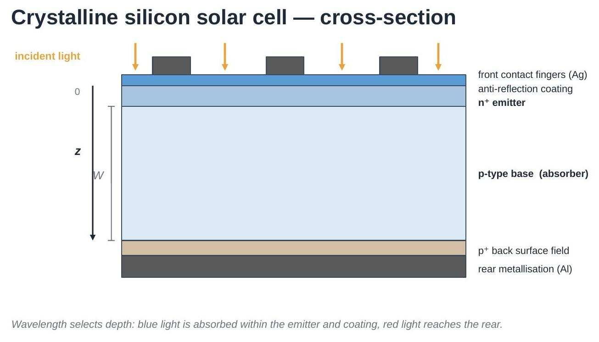
</div>

Equations are numbered (1), (2), ... and referred to by those numbers
throughout. All physics functions live in
[`eqe_helper.py`](https://github.com/Oxford-eMat-Lab/semiconductor-characterisation/blob/main/EQE/eqe_helper.py), so the notebook itself stays short;
that module's docstrings point back to these equation numbers.

## 1. Photons and the useful wavelength range

The energy carried by one photon is

$$
E_{\text{phot}}(\lambda) = \frac{hc}{\lambda} \tag{1}
$$

with $h$ the Planck constant and $c$ the speed of light. Short wavelength
= high energy.

To generate an electron-hole pair, a photon needs at least the bandgap
energy $E_g$. For silicon $E_g = 1.12\ \text{eV}$, which by (1)
corresponds to $\lambda \approx 1107\ \text{nm}$ — the **absorption
edge**. Longer wavelengths pass through without generating carriers, so
the useful range for a silicon cell is roughly 300-1200 nm.

```python
import numpy as np
import matplotlib.pyplot as plt
import eqe_helper as eh

plt.rcParams.update({'font.size': 12})

wavelength_nm = np.linspace(280, 1250, 400)
E_photon = eh.photon_energy_eV(wavelength_nm)      # Eq. (1)

plt.figure(figsize=(6, 3.8))
plt.plot(wavelength_nm, E_photon)
plt.axvline(eh.LAMBDA_G_NM, ls='--', color='k',
            label=f'Si absorption edge, {eh.LAMBDA_G_NM:.0f} nm')
plt.axhline(eh.EG_SI_EV, ls=':', color='gray', label='$E_g$ = 1.12 eV')
plt.xlabel('Wavelength (nm)'); plt.ylabel('Photon energy (eV)')
plt.legend(); plt.tight_layout(); plt.show()
```

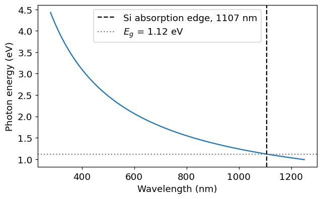

## 2. Absorption: how deep does the light go?

Inside the semiconductor, the photon flux decays exponentially with depth
$z$ (Lambert-Beer):

$$
\Phi(\lambda, z) = \Phi_0(\lambda)\, e^{-\alpha(\lambda)\, z} \tag{2}
$$

where $\alpha(\lambda)$ is the **absorption coefficient**. The depth at
which the flux has fallen to $1/e \approx 37\%$ is the **absorption
length**:

$$
L_\alpha(\lambda) = \frac{1}{\alpha(\lambda)} \tag{3}
$$

Silicon has an *indirect* bandgap: absorption near $E_g$ needs phonon
assistance, so $\alpha$ decreases gradually over hundreds of nm rather
than cutting off sharply. Across 300-1200 nm it varies by **six orders of
magnitude** — the single most important fact behind the shape of an EQE
curve.

```python
wl = np.linspace(280, 1200, 400)
alpha = eh.alpha_silicon(wl)             # 1/cm
L_alpha = eh.absorption_length_um(wl)    # um, Eq. (3)

fig, axes = plt.subplots(1, 2, figsize=(11, 3.8))

axes[0].semilogy(wl, alpha)
axes[0].axvline(eh.LAMBDA_G_NM, ls='--', color='k', lw=1)
axes[0].set_xlabel('Wavelength (nm)')
axes[0].set_ylabel(r'$\alpha$ (cm$^{-1}$)')
axes[0].set_title('Absorption coefficient')

axes[1].semilogy(wl, L_alpha)
axes[1].axhline(160, ls='-.', color='C3', lw=1, label='cell thickness, 160 $\\mu$m')
axes[1].axvline(eh.LAMBDA_G_NM, ls='--', color='k', lw=1)
axes[1].set_xlabel('Wavelength (nm)')
axes[1].set_ylabel(r'$L_\alpha$ ($\mu$m)')
axes[1].set_title('Absorption length')
axes[1].legend(fontsize=9)

plt.tight_layout(); plt.show()

for wl_i in [300, 500, 800, 1000, 1100]:
    print(f"{wl_i:5d} nm : L_alpha = {eh.absorption_length_um(wl_i):10.3f} um")
```

```text
  300 nm : L_alpha =      0.010 um
  500 nm : L_alpha =      1.000 um
  800 nm : L_alpha =     25.000 um
 1000 nm : L_alpha =    294.118 um
 1100 nm : L_alpha =   1666.667 um
```

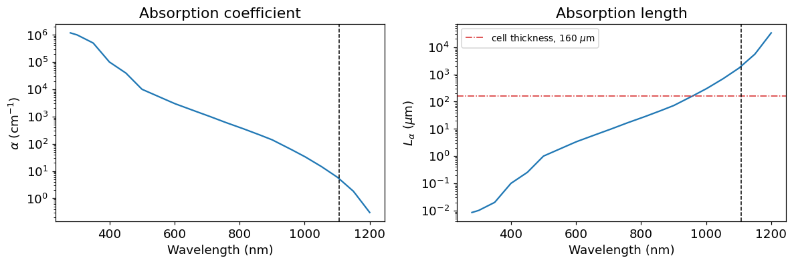

Read the right-hand plot against the cell thickness line:

- **300 nm**: $L_\alpha \approx 0.01\ \mu\text{m}$. All the light is
  absorbed in the first few tens of nm — inside the coating and emitter,
  right at the front surface.
- **800 nm**: $L_\alpha \approx 25\ \mu\text{m}$. Absorbed comfortably
  inside the base, well away from both surfaces. This is the cell's
  sweet spot.
- **1100 nm**: $L_\alpha \gg W$. Most light crosses the whole cell and
  reaches the rear, where it may escape or be reflected back.

So **wavelength selects depth**, and depth decides which loss mechanism
the carriers will meet. That is what makes a wavelength-resolved
measurement so diagnostic.

## 3. Where do the incident photons go?

Before any carrier physics, some photons never reach the absorber at all.
Of the light arriving at the cell:

- a fraction $R_{\text{ext}}$ is **reflected** straight back out — this is
  the external reflectance you measure with a spectrophotometer;
- a fraction $A_{\text{ext}}$ is **parasitically absorbed**, meaning
  absorbed somewhere that generates no collectable current: the
  anti-reflection coating, the metal fingers, the heavily doped emitter;
- what remains is transmitted into the absorber. That fraction is the
  **external transmission**:

$$
T_{\text{ext}}(\lambda) = 1 - R_{\text{ext}}(\lambda) - A_{\text{ext}}(\lambda) \tag{4}
$$

The three add to one by construction — every incident photon is
reflected, parasitically absorbed, or delivered to the absorber.

<div align="center">
   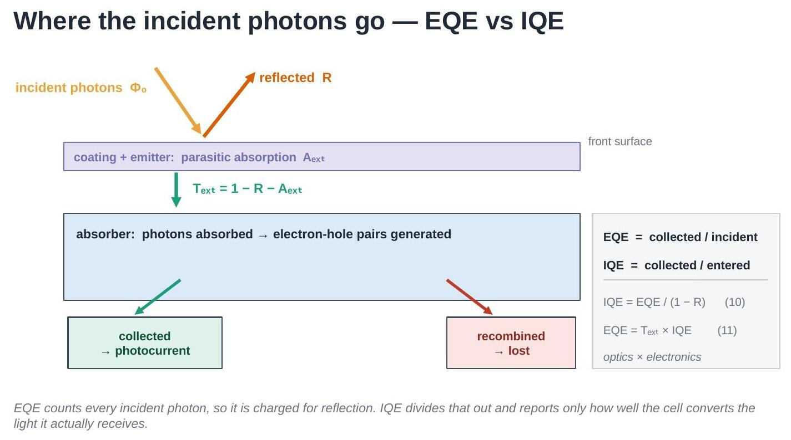
</div>

This split is the reason two different efficiencies are needed. One
counts carriers per *incident* photon (EQE, Section 5); the other counts
carriers per photon that *got in* (IQE, Section 6). Keeping them apart is
what lets you tell an optical problem from an electrical one.

```python
wl = np.linspace(300, 1200, 300)

R_ext = eh.arc_reflectance(wl)              # external reflectance
A_ext = eh.parasitic_absorptance(wl)        # lost in coating / emitter
T_ext = eh.external_transmission(wl)        # Eq. (4): 1 - R_ext - A_ext

print("R_ext + A_ext + T_ext = 1 everywhere:",
      np.allclose(R_ext + A_ext + T_ext, 1.0))

plt.figure(figsize=(6.5, 4))
plt.stackplot(wl, R_ext, A_ext, T_ext,
              labels=['$R_{ext}$  (reflected)',
                      '$A_{ext}$  (parasitically absorbed)',
                      '$T_{ext}$  (into the absorber)'],
              colors=['#d95f02', '#7570b3', '#1b9e77'], alpha=0.85)
plt.xlabel('Wavelength (nm)'); plt.ylabel('Fraction of incident photons')
plt.ylim(0, 1); plt.xlim(wl.min(), wl.max())
plt.legend(loc='center', fontsize=9, framealpha=0.95)
plt.title('Photon accounting at the front surface')
plt.tight_layout(); plt.show()
```

```text
R_ext + A_ext + T_ext = 1 everywhere: True
```

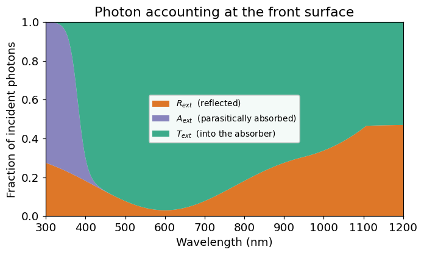

The anti-reflection coating works best near its design wavelength
(~600 nm here), where almost everything gets in. In the UV, parasitic
absorption dominates. At long wavelengths reflection rises again, because
weakly absorbed light reaches the rear surface and can leave the cell.

## 4. Generation and collection

Every absorbed photon generates one electron-hole pair. The generation
rate per unit depth follows by differentiating (2):

$$
g(\lambda, z) = -\frac{d\Phi}{dz}
= \big(1-R(\lambda)\big)\,\Phi_0(\lambda)\,\alpha(\lambda)\, e^{-\alpha(\lambda) z} \tag{5}
$$

Generating a carrier is not enough — it must reach a contact before it
recombines. A minority carrier with diffusion constant $D$ and lifetime
$\tau$ travels, on average, a **diffusion length**

$$
L = \sqrt{D\tau} \tag{6}
$$

before recombining. The probability that a carrier generated at depth $z$
is actually collected is the **collection efficiency**:

$$
\eta_c(z) = \cosh\!\left(\frac{z}{L}\right)
          - \frac{L}{L_{\text{eff}}}\,\sinh\!\left(\frac{z}{L}\right) \tag{7}
$$

$$
L_{\text{eff}} = L\,
\frac{LS\sinh(W/L) + D\cosh(W/L)}{LS\cosh(W/L) + D\sinh(W/L)} \tag{8}
$$

where $W$ is the base thickness and $S$ the **rear surface recombination
velocity**. Two knobs matter: a longer $L$ (better bulk material) and a
smaller $S$ (better rear passivation) both raise $\eta_c$ deep in the
cell.

Note that $S$ has units of cm/s and $D$ of cm$^2$/s, so it is the product
$LS$ — not $S$ alone — that is commensurate with $D$ in (8).

### These are approximations

Equations (7) and (8) are the closed-form solution of the **minority-carrier
diffusion equation** in a quasi-neutral base, and they hold only under the
assumptions that go with it: low injection, a field-free base, constant $D$,
$\tau$ and doping, one dimension, and all collection happening at a single
depletion-region edge. Real cells break every one of these — there are
built-in fields from doping gradients, injection-dependent lifetime,
band-gap narrowing, and light trapping that makes the generation profile
non-exponential.

A quantitative answer needs a full **drift-diffusion** calculation, which
solves Poisson's equation together with the electron and hole continuity
equations self-consistently (PC1D, Quokka3, Sentaurus, or an equivalent
numerical solver). That is what you would use to fit a real measurement or
to certify a device.

The closed form is kept here because it is what makes the physics legible:
it shows explicitly that only two material parameters, $L$ and $S$, set the
long-wavelength response, and it reproduces the correct shape and trends.
Use it to reason about *why* a curve looks the way it does, not to extract
numbers. The standard derivation is in any device-physics text — for
example Sze & Ng, *Physics of Semiconductor Devices*, or Green, *Solar
Cells: Operating Principles, Technology and System Applications*.

<div align="center">
   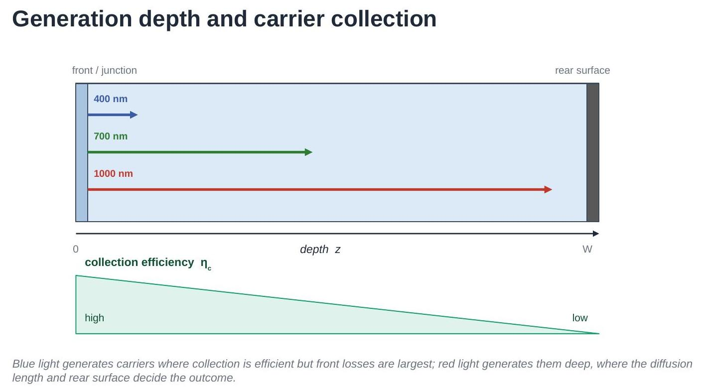
</div>

```python
z = np.linspace(0, 160, 400)   # depth, um
W = 160.0                       # base thickness, um

fig, axes = plt.subplots(1, 2, figsize=(11, 3.8))

# Generation profiles, Eq. (5) - log scale, decay lengths span decades
for wl_i, style in zip([400, 700, 1000], ['-', '--', ':']):
    axes[0].semilogy(z, eh.generation_profile(z, wl_i), style, label=f'{wl_i} nm')
axes[0].set_xlabel(r'Depth, $z$ ($\mu$m)')
axes[0].set_ylabel(r'$g(z)$ (normalised, $\mu$m$^{-1}$)')
axes[0].set_title('Where carriers are generated, Eq. (5)')
axes[0].set_ylim(1e-6, 20); axes[0].legend(fontsize=9)

# Collection efficiency, Eq. (7), for different diffusion lengths
for L_i in [0.5 * W, 1.0 * W, 4.0 * W]:
    axes[1].plot(z, eh.collection_efficiency(z, L_um=L_i, W_um=W, S_cm_s=100.0),
                 label=f'L = {L_i / W:.1f} W')
axes[1].set_xlabel(r'Depth, $z$ ($\mu$m)')
axes[1].set_ylabel(r'$\eta_c(z)$')
axes[1].set_title('Whether they survive, Eq. (7)')
axes[1].set_ylim(0, 1.05); axes[1].legend(fontsize=9)

plt.tight_layout(); plt.show()

print(f"L = sqrt(D*tau) for D=27 cm^2/s, tau=100 us : "
      f"{eh.diffusion_length_um(27.0, 100.0):.0f} um   [Eq. (6)]")
```

```text
L = sqrt(D*tau) for D=27 cm^2/s, tau=100 us : 520 um   [Eq. (6)]
```

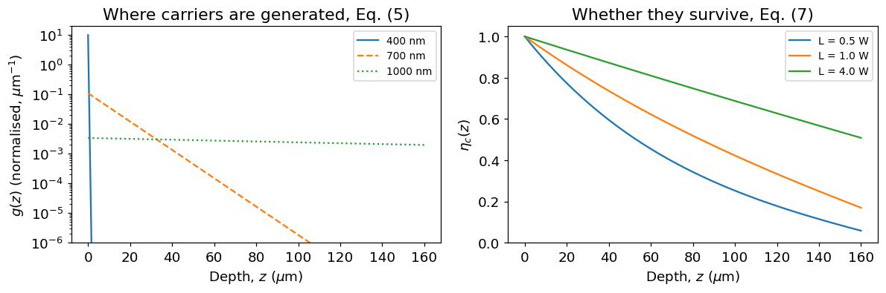

Put the two panels together and the whole technique follows: blue
light generates carriers where $\eta_c$ is high but the front losses are
worst; red light generates them deep, where $\eta_c$ has decayed.

## 5. External quantum efficiency

**EQE is the fraction of incident photons that produce a collected
electron.** Weighting the generation profile (5) by the collection
efficiency (7) and integrating over the cell thickness:

$$
\text{EQE}(\lambda) = \frac{1}{\Phi_0(\lambda)}\int_0^{W} g(\lambda,z)\,\eta_c(z)\, dz \tag{9}
$$

EQE is dimensionless and lies between 0 and 1. It is "external" because
it is referenced to the photons arriving at the cell — reflection losses
included, and therefore counted against the cell.

```python
wl = np.linspace(300, 1200, 300)

eqe = eh.eqe_spectrum(wl, W_um=160.0, L_um=250.0, S_cm_s=100.0)   # Eq. (9)
R = eh.arc_reflectance(wl)

fig, ax1 = plt.subplots(figsize=(7, 4.2))
ax1.plot(wl, eqe, color='C0', lw=2, label='EQE')
ax1.set_xlabel('Wavelength (nm)'); ax1.set_ylabel('EQE', color='C0')
ax1.set_ylim(0, 1.05); ax1.tick_params(axis='y', labelcolor='C0')

ax2 = ax1.twinx()
ax2.plot(wl, R, color='C1', ls='--', label='Reflectance $R_{ext}$')
ax2.set_ylabel('Reflectance $R_{ext}$', color='C1')
ax2.set_ylim(0, 1.05); ax2.tick_params(axis='y', labelcolor='C1')

ax1.annotate('front-surface\nlosses', xy=(350, 0.25), fontsize=9, ha='center')
ax1.annotate('plateau:\nnear-ideal', xy=(600, 0.55), fontsize=9, ha='center')
ax1.annotate('weak absorption\n+ rear losses', xy=(1080, 0.25), fontsize=9, ha='center')

plt.title('EQE and reflectance of the modelled cell')
fig.tight_layout(); plt.show()
```

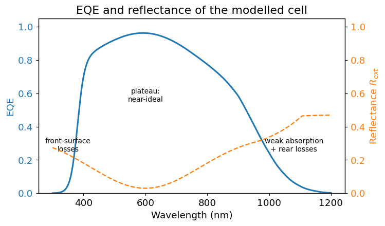

The three regions of every silicon EQE curve:

- **UV / blue (300-450 nm)**: light is absorbed in the coating and
  emitter. Parasitic absorption and heavy front recombination make EQE
  low. This region reports on **front surface quality**.
- **Plateau (450-900 nm)**: light enters easily (ARC minimum) and is
  absorbed in the base, where collection is efficient. EQE approaches its
  maximum. The gentle slope tracks the rise in $R_{\text{ext}}$.
- **Near-IR (>950 nm)**: $\alpha$ collapses, so light is absorbed deep,
  weakly, or not at all. This region reports on **bulk lifetime and rear
  surface**.

## 6. Internal quantum efficiency

EQE mixes two very different things: how much light *gets into* the cell
(optics) and how well the carriers it makes are *collected*
(electronics). A cell can have poor EQE simply because its coating
reflects badly — with nothing wrong electrically.

**IQE removes the optical loss.** It counts collected electrons per
photon that *entered the absorber* — so the reference population is not
the incident light but $T_{\text{ext}}$ from (4):

$$
\text{EQE}(\lambda) = T_{\text{ext}}(\lambda)\cdot \text{IQE}(\lambda)
\tag{10}
$$

In words: **EQE = (how much light gets in) × (how well it is converted).**
Rearranged, that is the definition of IQE:

$$
\text{IQE}(\lambda) = \frac{\text{EQE}(\lambda)}{T_{\text{ext}}(\lambda)}
= \frac{\text{EQE}(\lambda)}{1 - R_{\text{ext}}(\lambda) - A_{\text{ext}}(\lambda)}
\tag{11}
$$

**A caution about the form you will usually see.** In the laboratory
$R_{\text{ext}}$ is easy to measure and $A_{\text{ext}}$ is not, so IQE is
almost always evaluated as

$$
\text{IQE}(\lambda) \simeq \frac{\text{EQE}(\lambda)}{1 - R_{\text{ext}}(\lambda)}
$$

This is **not** the same quantity as (11); it is (11) with
$A_{\text{ext}}$ set to zero, i.e. it charges every non-reflected photon
to the absorber. Where the front layers absorb little the two agree, and
across most of the spectrum they do. In the UV and blue, where the light
is stopped inside the coating and emitter, $A_{\text{ext}}$ is large,
$1 - R_{\text{ext}} > T_{\text{ext}}$, and the approximation therefore
**under-estimates** IQE. The code below shows the size of that gap.

Whichever form you use, say which one — a great deal of published
disagreement between "IQE" curves is really disagreement about the
denominator. Since $T_{\text{ext}} \le 1$, IQE is always $\ge$ EQE, and a
perfectly collecting absorber gives $\text{IQE} \to 1$ wherever the light
is fully absorbed.

```python
wl = np.linspace(300, 1200, 300)

# Same cell, two different anti-reflection coatings (an OPTICAL change only)
R_good = eh.arc_reflectance(wl)                              # good ARC
R_poor = eh.arc_reflectance(wl, R_min=0.18, R_uv=0.42)       # poor ARC

eqe_good = eh.eqe_spectrum(wl, L_um=250, S_cm_s=100, reflectance=R_good)
eqe_poor = eh.eqe_spectrum(wl, L_um=250, S_cm_s=100, reflectance=R_poor)

# Eq. (11): divide by T_ext, not by (1 - R_ext)
A_good = eh.parasitic_absorptance(wl, reflectance=R_good)
A_poor = eh.parasitic_absorptance(wl, reflectance=R_poor)
iqe_good = eh.iqe_from_eqe(eqe_good, R_good, A_good)
iqe_poor = eh.iqe_from_eqe(eqe_poor, R_poor, A_poor)

# the common laboratory approximation, for comparison
iqe_approx = eh.iqe_from_eqe(eqe_good, R_good)

fig, axes = plt.subplots(1, 2, figsize=(11, 4), sharey=True)

axes[0].plot(wl, eqe_good, lw=2, label='good ARC')
axes[0].plot(wl, eqe_poor, lw=2, label='poor ARC')
axes[0].set_title('EQE  — differs'); axes[0].set_ylabel('Efficiency')

axes[1].plot(wl, iqe_good, lw=2, label='good ARC')
axes[1].plot(wl, iqe_poor, lw=3, ls='--', label='poor ARC')
axes[1].plot(wl, iqe_approx, lw=1.5, ls=':', color='C3',
             label='approx.  EQE/(1$-R_{ext}$)')
axes[1].set_title('IQE — identical (and the approximation)')

for ax in axes:
    ax.set_xlabel('Wavelength (nm)'); ax.set_ylim(0, 1.05); ax.legend(fontsize=8)
plt.tight_layout(); plt.show()

print(f"Jsc, good ARC : {eh.jsc_from_eqe(wl, eqe_good):.2f} mA/cm^2")
print(f"Jsc, poor ARC : {eh.jsc_from_eqe(wl, eqe_poor):.2f} mA/cm^2")
print("IQE curves agree:",
      np.allclose(iqe_good[wl > 350], iqe_poor[wl > 350], equal_nan=True))
i400 = np.argmin(abs(wl - 400))
print(f"at 400 nm: IQE = {iqe_good[i400]:.3f}, "
      f"approximation = {iqe_approx[i400]:.3f} "
      f"({100*(1 - iqe_approx[i400]/iqe_good[i400]):.0f}% low)")
```

```text
Jsc, good ARC : 28.97 mA/cm^2
Jsc, poor ARC : 24.82 mA/cm^2
IQE curves agree: True
at 400 nm: IQE = 1.000, approximation = 0.848 (15% low)
```

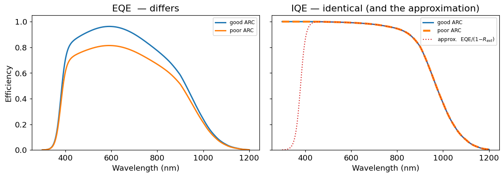

This is the whole point of IQE. Two cells, electrically identical,
differing only in their coating: their **EQE curves differ and their
$J_{sc}$ differs**, but their **IQE curves lie exactly on top of each
other**. So:

- EQE dropped **and** IQE dropped $\rightarrow$ an **electrical** problem
  (lifetime, passivation, junction).
- EQE dropped but IQE unchanged $\rightarrow$ an **optical** problem
  (coating, texture, shading).

EQE tells you *how much current you get*; IQE tells you *why*.

## 7. Spectral response

EQE is defined per *photon*, but an instrument measures **current** for a
given **optical power**. That ratio is the **spectral response** $SR$
(also called spectral responsivity), in amps per watt:

$$
SR(\lambda) = \text{EQE}(\lambda)\,\frac{q\lambda}{hc} \tag{12}
$$

$$
\text{EQE}(\lambda) = SR(\lambda)\,\frac{hc}{q\lambda} \tag{13}
$$

The two carry the same information; (13) is just (12) rearranged. The
factor $\lambda$ comes straight from (1): one watt of red light contains
more photons than one watt of blue light, so the same EQE yields more
current per watt at longer wavelength. This is why $SR$ keeps rising
across the plateau where EQE is flat, and why **$SR$ — not EQE — is the
quantity a measurement actually produces** (Section 10).

```python
wl = np.linspace(300, 1200, 300)
eqe = eh.eqe_spectrum(wl, L_um=250, S_cm_s=100)

SR = eh.spectral_response_from_eqe(wl, eqe)      # Eq. (12), A/W

# The ideal limit: EQE = 1 at every wavelength
SR_ideal = eh.spectral_response_from_eqe(wl, np.ones_like(wl))

fig, axes = plt.subplots(1, 2, figsize=(11, 4))

axes[0].plot(wl, eqe, lw=2, color='C0')
axes[0].set_ylabel('EQE'); axes[0].set_ylim(0, 1.05)
axes[0].set_title('EQE — per photon')

axes[1].plot(wl, SR, lw=2, color='C2', label='this cell')
axes[1].plot(wl, SR_ideal, ls=':', color='gray', label='ideal, EQE = 1')
axes[1].set_ylabel('Spectral response (A/W)')
axes[1].set_title('SR — per watt, Eq. (12)')
axes[1].legend(fontsize=9)

for ax in axes:
    ax.set_xlabel('Wavelength (nm)')
plt.tight_layout(); plt.show()

# Eq. (13) recovers EQE exactly
print("Round trip SR -> EQE exact:",
      np.allclose(eh.eqe_from_spectral_response(wl, SR), eqe))
```

```text
Round trip SR -> EQE exact: True
```

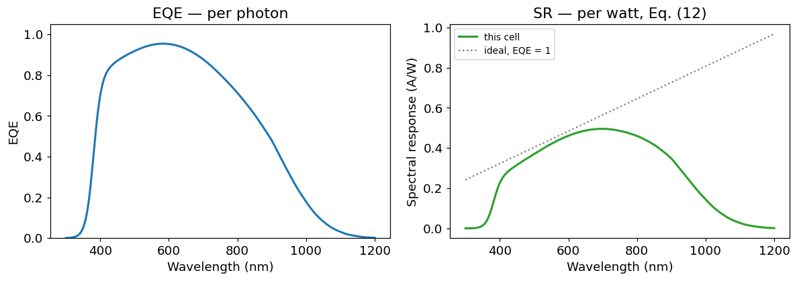

The dotted line is the physical ceiling: a perfect cell converting
every photon still has an $SR$ that rises linearly with $\lambda$, purely
because of (1). Comparing a measured $SR$ against that ceiling is another
way of reading EQE.

## 8. Short-circuit current from EQE

EQE also predicts a headline device parameter. Each wavelength
contributes photons at a rate $\Phi_0(\lambda)$ (the spectral photon flux
of the illumination), of which a fraction EQE becomes collected charge:

$$
J_{sc} = q \int \Phi_0(\lambda)\,\text{EQE}(\lambda)\, d\lambda \tag{14}
$$

Under standard test conditions, $\Phi_0$ is the AM1.5G reference
spectrum. Equation (14) is what makes EQE quantitative rather than merely
diagnostic — and it is also the basis of the calibration in Section 11.

```python
wl = np.linspace(300, 1200, 400)
eqe = eh.eqe_spectrum(wl, L_um=250, S_cm_s=100)

spectrum = eh.am15g_simplified(wl)                       # W/(m^2 nm)
phi0 = eh.photon_flux_spectral(wl, spectrum)             # photons/(s m^2 nm)
contribution = eh.Q * phi0 * eqe * 1e-1                  # mA/cm^2 per nm

fig, ax1 = plt.subplots(figsize=(7, 4.2))
ax1.fill_between(wl, contribution, alpha=0.35, color='C0',
                 label='collected (contributes to $J_{sc}$)')
ax1.plot(wl, eh.Q * phi0 * 1e-1, color='k', lw=1.2,
         label='available in the spectrum')
ax1.set_xlabel('Wavelength (nm)')
ax1.set_ylabel('Current density per nm (mA cm$^{-2}$ nm$^{-1}$)')
ax1.legend(fontsize=9)
plt.title('Which wavelengths supply the current, Eq. (14)')
plt.tight_layout(); plt.show()

jsc = eh.jsc_from_eqe(wl, eqe)                           # Eq. (14)
print(f"Jsc over 300-1200 nm = {jsc:.2f} mA/cm^2")
```

```text
Jsc over 300-1200 nm = 28.97 mA/cm^2
```

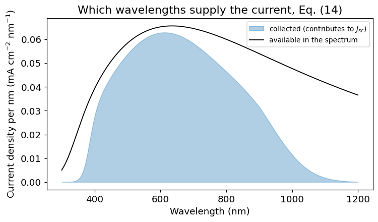

The gap between the two curves is the loss budget, resolved by
wavelength — the area you would recover by fixing each loss mechanism.

## 9. Reading a real device: front vs rear

Because wavelength selects depth (Section 2), the two ends of the curve
interrogate opposite faces of the cell:

| Region | Probes | Sensitive to |
|---|---|---|
| 300-500 nm | front surface, emitter | coating, front passivation, emitter doping |
| 500-900 nm | base (bulk) | overall optics, bulk quality |
| 900-1200 nm | deep base, rear surface | diffusion length $L$, rear velocity $S$, rear reflector |

A standard illustration is the aluminium back-surface-field (Al-BSF) cell
versus the passivated emitter and rear cell (PERC). PERC adds a
dielectric rear layer that both passivates the rear (lower $S$) and
reflects weakly absorbed light back into the cell. The difference should
appear **only in the near-IR**.

<div align="center">
   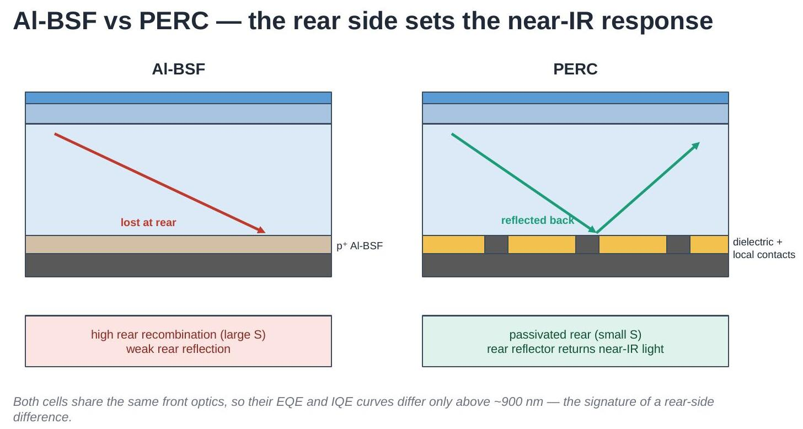
</div>

```python
wl = np.linspace(300, 1200, 300)

# Al-BSF-like: shorter diffusion length, fast rear recombination
eqe_albsf = eh.eqe_spectrum(wl, W_um=160, L_um=150, S_cm_s=1000.0)
# PERC-like: longer diffusion length, well-passivated rear
eqe_perc = eh.eqe_spectrum(wl, W_um=160, L_um=250, S_cm_s=20.0)

R = eh.arc_reflectance(wl)                    # identical front optics
A = eh.parasitic_absorptance(wl, reflectance=R)
iqe_albsf = eh.iqe_from_eqe(eqe_albsf, R, A)  # Eq. (11)
iqe_perc = eh.iqe_from_eqe(eqe_perc, R, A)

fig, axes = plt.subplots(1, 2, figsize=(11, 4), sharey=True)

axes[0].plot(wl, eqe_albsf, lw=2, label='Al-BSF-like')
axes[0].plot(wl, eqe_perc, lw=2, label='PERC-like')
axes[0].set_title('EQE'); axes[0].set_ylabel('Efficiency')

axes[1].plot(wl, iqe_albsf, lw=2, label='Al-BSF-like')
axes[1].plot(wl, iqe_perc, lw=2, label='PERC-like')
axes[1].set_title('IQE — gap is electrical')

for ax in axes:
    ax.axvspan(900, 1200, color='0.9', zorder=0)
    ax.set_xlabel('Wavelength (nm)'); ax.set_ylim(0, 1.05); ax.legend(fontsize=9)
plt.tight_layout(); plt.show()

print(f"Jsc Al-BSF-like : {eh.jsc_from_eqe(wl, eqe_albsf):.2f} mA/cm^2")
print(f"Jsc PERC-like   : {eh.jsc_from_eqe(wl, eqe_perc):.2f} mA/cm^2")
```

```text
Jsc Al-BSF-like : 27.48 mA/cm^2
Jsc PERC-like   : 29.07 mA/cm^2
```

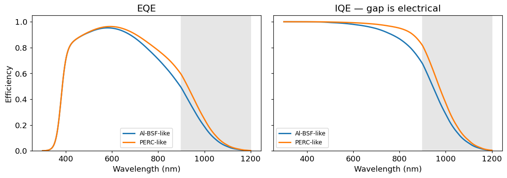

The curves are indistinguishable below about 700 nm and separate
progressively across the shaded near-IR band — exactly the signature of a
rear-side difference.
Because both cells here share the same front optics, IQE separates by the
same amount as EQE, confirming the cause is electrical rather than
optical.

## 10. Measuring: spectral response and the DSR method

EQE cannot be measured directly. What an instrument measures is current
per unit optical power, i.e. $SR$ from Section 7, which is then converted
to EQE with (13).

One further complication: a solar cell's response can depend on how
strongly it is already illuminated, because recombination is
injection-dependent. Measuring a dark cell with a dim monochromatic beam
would not describe the cell at operating conditions. The standard
solution is a **differential** measurement:

1. Hold the cell under steady white **bias light**, setting a realistic
   injection level.
2. Add a small, chopped **monochromatic** beam of wavelength $\lambda$.
3. Recover the resulting small AC current with a lock-in amplifier.

The measured quantity is the **differential spectral responsivity**:

$$
\tilde{s}(\lambda, E_{\text{bias}})
= \frac{\Delta j_{sc}(\lambda)}{\Delta E_\lambda(\lambda)} \tag{15}
$$

<div align="center">
   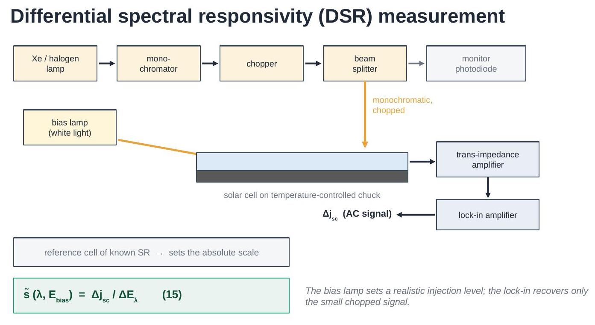
</div>

The absolute scale of $\Delta E_\lambda$ is not known from the instrument
alone, so a **reference cell** of known responsivity is measured under
the same conditions and the unknown gain factors divide out — but only up
to one constant, which Section 11 fixes.

```python
wl = np.linspace(300, 1200, 150)
eqe_true = eh.eqe_spectrum(wl, W_um=160, L_um=250, S_cm_s=100.0)

# A realistic measurement: noise, plus an unknown overall calibration
# scale factor left over from the reference-cell comparison, Eq. (15)
s_measured = eh.synthetic_dsr_measurement(
    wl, eqe_true, noise_level=0.015, calibration_scale=1.08, random_state=1)

eqe_relative = eh.eqe_from_spectral_response(wl, s_measured)   # Eq. (13)

fig, axes = plt.subplots(1, 2, figsize=(11, 4))

axes[0].plot(wl, s_measured, '.', ms=3, color='C2')
axes[0].set_ylabel('Measured $\\tilde{s}$ (A/W)')
axes[0].set_title('What the instrument records, Eq. (15)')

axes[1].plot(wl, eqe_true, lw=2, label='true EQE')
axes[1].plot(wl, eqe_relative, '.', ms=3, alpha=0.7, label='relative EQE')
axes[1].set_ylabel('EQE'); axes[1].set_ylim(0, 1.2)
axes[1].set_title('After converting with Eq. (13)')
axes[1].legend(fontsize=9)

for ax in axes:
    ax.set_xlabel('Wavelength (nm)')
plt.tight_layout(); plt.show()
```

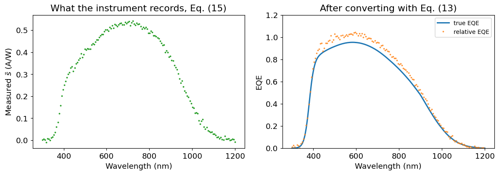

## 11. From relative to absolute EQE

The converted curve has the right *shape* but the wrong *scale* — note
that it exceeds 1, which is unphysical. The remaining unknown constant is
removed by requiring that the EQE reproduce an independently measured
short-circuit current, via (14):

$$
f_{sc} = \frac{J_{sc,\text{exp}}}{J_{sc,\text{calc}}},
\qquad
\text{EQE}_{\text{abs}}(\lambda) = f_{sc}\cdot \text{EQE}_{\text{rel}}(\lambda) \tag{16}
$$

where $J_{sc,\text{exp}}$ comes from a solar simulator measurement and
$J_{sc,\text{calc}}$ from integrating the relative EQE against the
reference spectrum. A well-calibrated setup gives $f_{sc}$ close to 1 —
the synthetic data below carries a deliberate 8% miscalibration, which
(16) removes. A value far from 1 signals a measurement problem rather
than a property of the cell.

```python
jsc_calc = eh.jsc_from_eqe(wl, eqe_relative)      # Eq. (14)

# Independent solar-simulator measurement of the same cell
jsc_exp = eh.jsc_from_eqe(wl, eqe_true)

f_sc = jsc_exp / jsc_calc                          # Eq. (16)
eqe_absolute = f_sc * eqe_relative

plt.figure(figsize=(6.8, 4.2))
plt.plot(wl, eqe_true, lw=2, color='k', label='true EQE')
plt.plot(wl, eqe_relative, '.', ms=3, alpha=0.6,
         label=f'relative ($J_{{sc}}$ = {jsc_calc:.1f} mA/cm$^2$)')
plt.plot(wl, eqe_absolute, '.', ms=3, alpha=0.8,
         label=f'absolute (scaled by $f_{{sc}}$ = {f_sc:.3f})')
plt.axhline(1.0, ls=':', color='gray', lw=1)
plt.xlabel('Wavelength (nm)'); plt.ylabel('EQE'); plt.ylim(0, 1.2)
plt.legend(fontsize=9); plt.title('Scaling to absolute EQE, Eq. (16)')
plt.tight_layout(); plt.show()

print(f"Jsc measured   = {jsc_exp:.2f} mA/cm^2")
print(f"Jsc calculated = {jsc_calc:.2f} mA/cm^2")
print(f"scaling factor = {f_sc:.3f}")
```

```text
Jsc measured   = 28.97 mA/cm^2
Jsc calculated = 31.23 mA/cm^2
scaling factor = 0.928
```

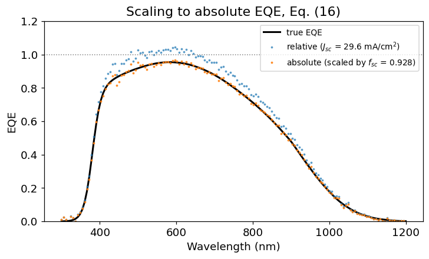

## 12. Linearity and bias-ramp measurements

If a cell is perfectly **linear**, its differential response $\tilde{s}$
does not depend on the bias level, and a single measurement suffices.
Real cells can deviate. The rigorous definition integrates $\tilde{s}$
over bias irradiance up to one sun:

$$
s_{\text{STC}}(\lambda) = \int_0^{1000\ \text{W/m}^2}
\tilde{s}(\lambda, E_{\text{bias}})\; dE_{\text{bias}} \tag{17}
$$

Measuring that full integral at every wavelength is slow, so simplified
procedures use a single bias point (commonly around
$300\ \text{W/m}^2$), which approximates (17) well for typical silicon
cells. A **bias ramp** — sweeping $E_{\text{bias}}$ at a fixed wavelength
— is how you check whether that shortcut is valid for a given device.

```python
E_bias = np.linspace(1, 1000, 200)     # W/m^2
s_stc = 0.42                            # A/W at the chosen wavelength

s_linear = eh.bias_ramp_dsr(E_bias, s_stc, nonlinearity=0.0)
s_nonlin = eh.bias_ramp_dsr(E_bias, s_stc, nonlinearity=0.15)

plt.figure(figsize=(6.8, 4.2))
plt.plot(E_bias, s_linear, lw=2, label='linear cell')
plt.plot(E_bias, s_nonlin, lw=2, label='nonlinear cell')
plt.axvline(300, ls='--', color='gray', label='single-point simplification')
plt.axvline(1000, ls=':', color='k', label='one sun (STC)')
plt.xlabel(r'Bias irradiance, $E_{bias}$ (W/m$^2$)')
plt.ylabel(r'$\tilde{s}$ (A/W)')
plt.legend(fontsize=9); plt.title('Bias ramp at a fixed wavelength, Eq. (17)')
plt.tight_layout(); plt.show()

dev = 100 * (s_nonlin[np.argmin(abs(E_bias - 300))] / s_nonlin[-1] - 1)
print(f"Nonlinear cell: measuring at 300 W/m^2 instead of 1000 W/m^2 "
      f"misestimates SR by {dev:+.1f}%")
```

```text
Nonlinear cell: measuring at 300 W/m^2 instead of 1000 W/m^2 misestimates SR by -4.3%
```

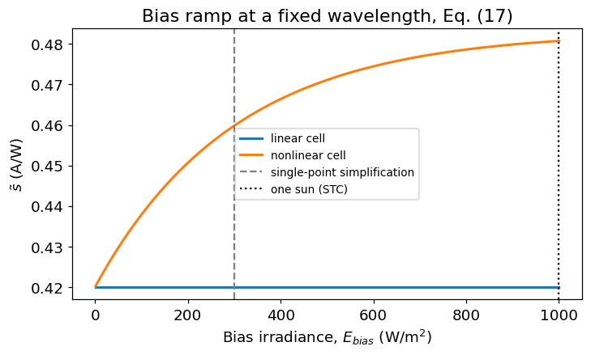

A flat line means the shortcut is safe. A sloping line means the
single-point measurement carries a systematic error, which must either be
corrected or reported.

## 13. Assumptions and limitations

The models here are deliberately simple. They assume:

- **one-dimensional** transport — no lateral current flow or finger
  shading effects;
- **uniform material** — constant $D$, $L$ and doping with depth, so the
  emitter is represented only by an empirical front-loss term;
- an **analytic reflectance** shape, not a thin-film interference
  calculation, and no explicit light-trapping / multiple-pass optics;
- a **coarse $\alpha(\lambda)$** interpolation and an approximate AM1.5G
  spectrum, adequate for shapes and trends but not for certification;
- **no series resistance** or injection-dependent recombination beyond
  the illustrative bias-ramp model of (17).

They are sufficient to explain and interpret the shape of an EQE curve,
which is the purpose here. Quantitative device work needs tabulated
optical constants, the standard reference spectrum, and a numerical
device simulator.

## Summary of equations

| # | Equation | Meaning |
|---|---|---|
| (1) | $E_{\text{phot}} = hc/\lambda$ | photon energy |
| (2) | $\Phi = \Phi_0 e^{-\alpha z}$ | Lambert-Beer absorption |
| (3) | $L_\alpha = 1/\alpha$ | absorption length |
| (4) | $T_{\text{ext}} = 1 - R - A_{\text{ext}}$ | light that reaches the absorber |
| (5) | $g = (1-R)\Phi_0\alpha e^{-\alpha z}$ | generation rate |
| (6) | $L = \sqrt{D\tau}$ | diffusion length |
| (7) | $\eta_c = \cosh(z/L) - (L/L_{\text{eff}})\sinh(z/L)$ | collection efficiency |
| (8) | $L_{\text{eff}} = L\,\frac{LS\sinh + D\cosh}{LS\cosh + D\sinh}$ | effective diffusion length |
| (9) | $\text{EQE} = \frac{1}{\Phi_0}\int_0^W g\,\eta_c\,dz$ | external quantum efficiency |
| (10) | $\text{EQE} = T_{\text{ext}}\cdot\text{IQE}$ | optics × electronics |
| (11) | $\text{IQE} = \text{EQE}/T_{\text{ext}}$ | internal quantum efficiency |
| (12) | $SR = \text{EQE}\;q\lambda/hc$ | spectral response |
| (13) | $\text{EQE} = SR\;hc/q\lambda$ | conversion back to EQE |
| (14) | $J_{sc} = q\int \Phi_0\,\text{EQE}\,d\lambda$ | short-circuit current |
| (15) | $\tilde{s} = \Delta j_{sc}/\Delta E_\lambda$ | differential spectral responsivity |
| (16) | $f_{sc} = J_{sc,\text{exp}}/J_{sc,\text{calc}}$ | absolute scaling factor |
| (17) | $s_{\text{STC}} = \int_0^{1000} \tilde{s}\,dE_{\text{bias}}$ | responsivity at STC |
